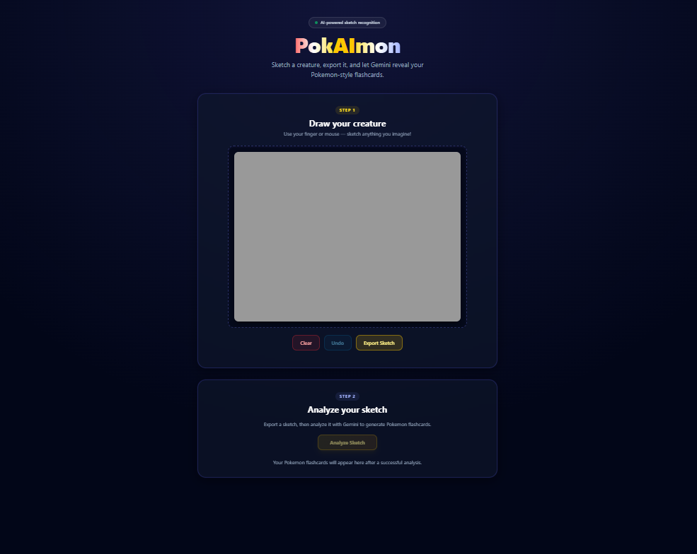
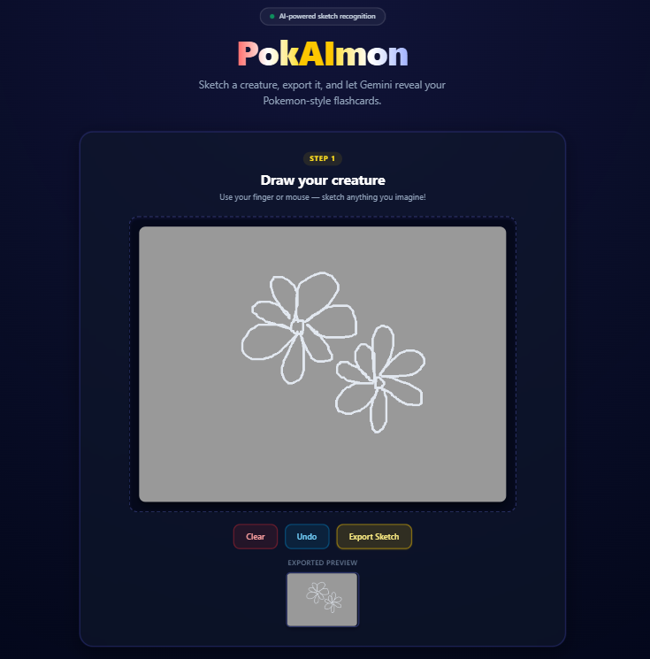
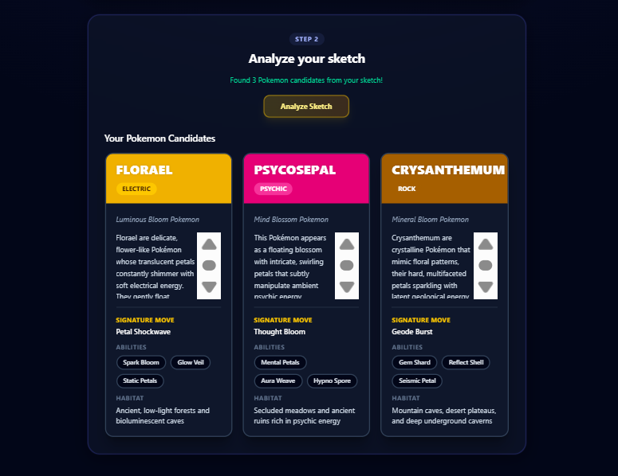

# PokAImon

Draw a creature, export your sketch, and let AI turn it into Pokemon-style flashcards.

**Live demo:** 
https://6a2ff0d99c5e7c4f2271dd05--ubiquitous-cascaron-fee516.netlify.app/

## What it does

PokAImon is a browser-based sketching app that uses Google's Gemini vision model to analyze your drawing and generate Pokemon-inspired flashcards. Each card includes a name, type, species, description, signature move, abilities, and habitat.

Works on desktop and mobile — draw with a mouse or your finger on a touch screen.

## Demo



*Draw your creature on the canvas, then export the sketch.*



*After exporting, analyze the sketch to generate Pokemon-style flashcards.*



## Local development

1. Clone the repo and install dependencies:

   ```bash
   npm install
   ```

2. Copy `.env.example` to `.env` and add your [Gemini API key](https://aistudio.google.com/apikey):

   ```bash
   cp .env.example .env
   ```

3. Start the dev server:

   ```bash
   npm run dev
   ```

## Tech stack

- React + Vite
- Tailwind CSS
- Google Gemini API
